# 数据模型

最后核对：2026-09-09。权威实现位于 `apps/api/app/models/entities.py`，生产迁移 head 为 `0005`。

## 1. 总体规则

- 主键当前均为整数。
- 开发使用 SQLite，生产使用 PostgreSQL；模型和迁移必须同时兼容两者。
- `DateTime` 当前按 naive UTC 保存，用户自然日通过 `users.timezone` 转换。
- 公共内容和用户私有状态分开存储。
- JSON 字段只保存有边界的结构化数据；重要筛选/关联字段应使用普通列和索引。
- 数据库约束是最终防线，应用服务仍需在写入前给出清晰校验错误。

## 2. 关系概览

```mermaid
erDiagram
    USERS ||--o{ USER_WORD_PROGRESS : learns
    USERS ||--o{ STUDY_REVIEWS : submits
    USERS ||--o{ VOCABULARY_ITEMS : owns
    USERS ||--o{ VOCABULARY_COLLECTIONS : owns
    USERS ||--o{ DAILY_STUDY_PLANS : owns
    USERS ||--o{ SENTENCE_BOOKMARKS : owns
    USERS ||--o{ READING_PROGRESS : tracks
    USERS ||--o{ READING_ACTIVITY : records
    USERS ||--o{ AI_PROVIDER_CONFIGS : configures
    USERS ||--o{ AI_CONVERSATIONS : owns
    USERS ||--o{ AI_USER_MEMORIES : owns
    USERS ||--o{ ARTICLES : may_own
    WORDBOOKS ||--o{ WORDBOOK_WORDS : contains
    WORDS ||--o{ WORDBOOK_WORDS : listed_in
    WORDLIST_SOURCES ||--o{ WORDLIST_SOURCE_ENTRIES : contains
    WORDS ||--o{ WORDLIST_SOURCE_ENTRIES : traced_to
    WORDS ||--o{ USER_WORD_PROGRESS : tracks
    WORDS ||--o{ STUDY_REVIEWS : reviewed_as
    WORDS ||--o{ VOCABULARY_ITEMS : referenced_by
    VOCABULARY_ITEMS ||--o{ VOCABULARY_COLLECTION_ITEMS : categorized_by
    VOCABULARY_COLLECTIONS ||--o{ VOCABULARY_COLLECTION_ITEMS : contains
    DAILY_STUDY_PLANS ||--o{ DAILY_STUDY_PLAN_ITEMS : snapshots
    WORDS ||--o{ DAILY_STUDY_PLAN_ITEMS : scheduled_as
    ARTICLES ||--o{ ARTICLE_SENTENCES : contains
    ARTICLES ||--o{ READING_PROGRESS : resumed_by
    ARTICLES ||--o{ READING_ACTIVITY : read_on
    ARTICLES ||--o{ SENTENCE_BOOKMARKS : source_snapshot
    ARTICLE_SENTENCES ||--o{ SENTENCE_BOOKMARKS : bookmarked_as
    AI_CONVERSATIONS ||--o{ AI_MESSAGES : contains
    AI_CONVERSATIONS ||--o{ AI_TOOL_RUNS : audits
```

## 3. 账号域

### `users`

保存邮箱、bcrypt 密码哈希、昵称、CEFR 等级、每日新词量、IANA 时区、当前系统/个人词书、示例内容版本和启用状态。

关键约束：

- `email` 唯一且有索引；注册/登录逻辑应保持统一规范化。
- `selected_wordbook_id` 指向公共 `wordbooks`。
- `selected_collection_id` 指向用户个人 `vocabulary_collections`；选择系统词书时清空该字段，选择个人词书时以该字段优先。
- `example_content_version` 记录示例收藏已初始化的版本，确保用户删除示例后不会被重建。
- 所有用户私有表通过 `user_id` 直接或间接归属用户。
- 密码明文永不入库。

## 4. 词典与学习域

### `words`

全局词典条目。`term` 唯一并建索引；包含音标、词性、主翻译、结构化释义、示例及示例翻译。这里不保存用户掌握状态。

### `wordbooks`

公共词书元数据：稳定唯一 `slug`、名称、描述、等级、封面色和发布状态。当前发布四级、六级、考研通用、考研英语一、考研英语二和雅思六本系统预设。`zhixian-core-en-v1` 只作为合并导入载体保留为未发布记录，不出现在产品入口。

### `wordbook_words`

词书与单词多对多关系，`(wordbook_id, word_id)` 唯一，`position` 表示学习顺序。删除词书或单词会级联删除关联。

### `wordlist_sources` / `wordlist_source_entries`

`wordlist_sources` 保存来源键、显示名、仓库、固定提交、文件路径、SHA-256、声明/解析数量、授权状态和转换版本。`wordlist_source_entries` 通过 `(source_id, word_id)` 唯一关系记录去重后的单词来自哪些原始词书及首次出现位置。

业务查询内容保存在 `words`；来源表是审计元数据，不把同一个英文词复制成多条。原始上游 JSON 不重复入库，去重后的 `data/wordlists/normalized/zhixian-core-en-v1.jsonl` 必须进入 Git，用于新主机初始化和容器启动导入；普通应用请求仍只读数据库。

### `user_word_progress`

每用户、每单词一条进度，`(user_id, word_id)` 唯一；保存状态、重复次数、间隔、难度因子、掌握分、上次和下次复习时间。`(user_id, next_review_at)` 有到期查询索引。

### `study_reviews`

不可替代的评分历史：用户、单词、评分、前后间隔和发生时间。`source_kind/source_id/source_name` 保存当次学习来源，`mode` 区分新学与复习，`(user_id, request_id)` 防止网络重试重复计分，`result_snapshot` 用于返回首次提交的确定结果。

### `daily_study_plans` / `daily_study_plan_items`

保存某用户某自然日的计划快照，解决复习后 `next_review_at` 改变导致无法还原原计划的问题。

- `(user_id, plan_date)` 唯一。
- 计划记录生成时区、算法版本和是否预测。
- 条目记录单词、`review|new` 类型、位置和完成时间。
- 未来计划可以即时预测而不持久化；对用户必须标明可能变化。

## 5. 生词本域

### `vocabulary_items`

“用户拥有这个生词”的事实，`(user_id, word_id)` 唯一；保存来源类型、来源引用、备注和加入时间。熟练度来自 `user_word_progress`，不重复存储。

### `vocabulary_collections`

用户自定义的分类容器，`(user_id, name)` 唯一。每位用户按需创建一个 `is_default=true` 的“默认生词本”；默认本不可重命名或删除。

### `vocabulary_collection_items`

生词与生词本的多对多关系，`(collection_id, vocabulary_item_id)` 唯一。同一生词可进入多个本；从某个本移除不等于删除用户生词或学习进度。

服务层必须证明 collection 和 vocabulary item 属于同一用户，不能只相信关联 ID。

## 6. 阅读域

### `articles`

保存标题、中英标题、摘要、等级、主题、阅读时长、视觉标识、发布状态和生成元数据。

- `owner_user_id=NULL` 表示公共内容。
- 非空表示用户私有内容，当前用于 Agent 生成的文章草稿。
- `source_type` 区分 `seed`、AI 生成等来源；生成内容不能伪装成权威语料。

### `article_sentences`

文章句子，`(article_id, position)` 唯一，保存英文和翻译。删除文章时级联删除句子。

### `sentence_bookmarks`

用户句子收藏同时保存原文、译文、来源标题/引用、笔记、标签和示例标识。文章句子关联可以为空；文章或原句删除后，收藏仍通过快照保留。`(user_id, dedup_key)` 防止同一来源和文本重复收藏，所有读写必须按用户过滤。

### `reading_progress` / `reading_activity`

`reading_progress` 以 `(user_id, article_id)` 唯一保存当前阅读位置、百分比和完成时间，用于跨设备恢复。`reading_activity` 以 `(user_id, article_id, day)` 唯一保存用户自然日内的最高进度和完成状态，为学习日历提供可审计事实；页面浏览不会伪造单词评分。

## 7. AI 域

### `ai_provider_configs`

每用户每 Provider 一条，保存厂商、服务端白名单地址、模型、启用/默认状态、API Key 密文和末四位。`(user_id, provider)` 唯一。

完整 Key 只能在服务端内存中短暂解密；任何读取 schema 都不得暴露 `api_key_ciphertext`。

### `ai_conversations`

会话归属用户并固定 Provider/模型，保存标题、轻量摘要、创建/更新时间和可选归档时间。归档不是删除；删除会话级联删除消息和工具审计。

### `ai_messages`

持久化 user、assistant、tool 消息，包含工具调用结构、Provider 元数据和 Token 用量。会话内按 ID/创建时间恢复顺序。

### `ai_tool_runs`

工具执行审计和确认状态：工具名、经校验参数、结果、摘要、状态、确认时间和幂等键。`idempotency_key` 全局唯一；确认操作必须执行原记录参数。

### `ai_user_memories`

用户明确授权的长期学习偏好，`(user_id, key)` 唯一。当前只允许 `preferred_topics`、`response_style`、`learning_goal`，不能把模型推断自动写入。

## 8. 所有权矩阵

| 数据 | 范围 | 查询要求 |
|---|---|---|
| `words`、已发布 `wordbooks` | 公共 | 可匿名/登录读取取决于路由策略 |
| 公共 `articles` | 公共 | `owner_user_id IS NULL` 且发布规则满足 |
| 个人文章草稿 | 单用户 | `owner_user_id=current_user.id` |
| 进度、评分、计划、生词、收藏 | 单用户 | 直接或经父资源绑定 `user_id` |
| Provider、会话、消息、工具、记忆 | 单用户 | 必须从当前用户验证所有权 |

任何新表都要在设计时声明其所有者、共享范围、删除语义、保留期限和索引，而不是只加一个外键。

## 9. 删除与保留

- 多数用户子表通过数据库外键 `ON DELETE CASCADE` 跟随用户或父实体删除。
- 生产中删除账号、会话、词书或单词前仍需产品确认、备份和影响评估。
- 已有用户进度引用的词条不能通过词库更新随意删除；优先取消发布或移除词书关联。
- 历史评分与工具审计是可解释性依据，不因更新当前状态而覆盖。
- 当前没有通用软删除框架；不要用布尔字段临时模拟而不定义查询规则。

## 10. 迁移流程

1. 修改 ORM 和 Pydantic/前端契约。
2. 新增下一编号 Alembic 迁移并审阅升级/降级。
3. 从空库运行到 head。
4. 从上一个生产 head 的带数据副本升级，检查约束、默认值和数据保留；`0005` 必须验证旧句子收藏快照回填。
5. 运行后端测试，并在 Docker PostgreSQL 演练。
6. 更新本文、API 和部署影响。
7. 生产部署前备份；迁移失败时按恢复方案处理，不能边试边手工改表。
